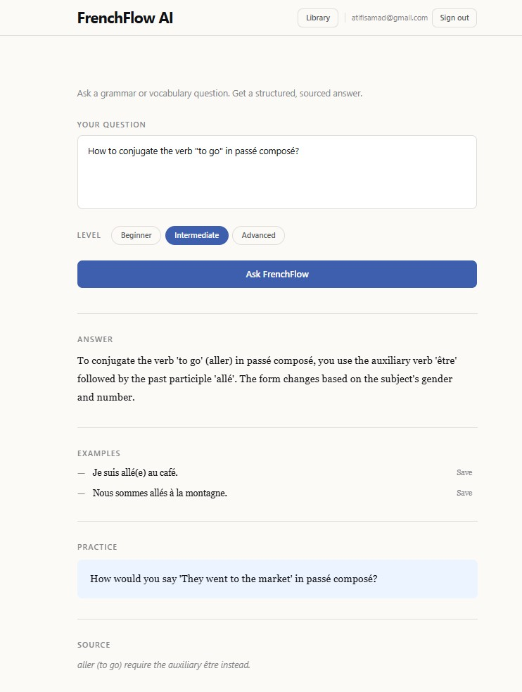
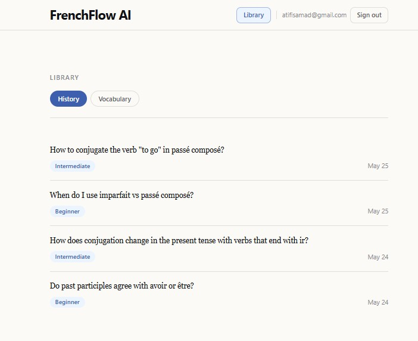
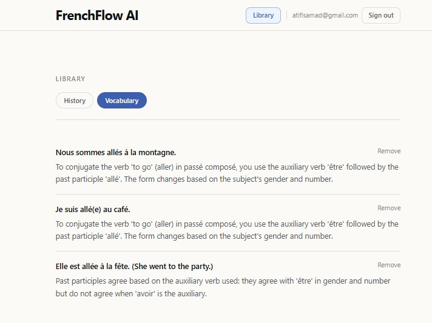

# FrenchFlow AI

An AI-powered French tutor that answers grammar and vocabulary questions using a curated knowledge base.

      

**Live site:** [frenchflow-ai.vercel.app](https://frenchflow-ai.vercel.app/)



Answered question view.



Learning history tab.



Saved vocabulary tab.

## Tech Stack

- **Frontend:** React, React Router, Tailwind CSS, Vite
- **Backend:** Python, FastAPI, Uvicorn
- **AI/RAG:** OpenAI API (`text-embedding-3-small`, `gpt-4o-mini`), Pinecone
- **User data:** Supabase Auth and Postgres through `@supabase/supabase-js`

## Features

- Ask any French grammar or vocabulary question in natural language
- Choose your learner level: Beginner, Intermediate, or Advanced
- Receive a structured answer with explanation, usage examples, a practice question, and a source reference
- Explanations and practice questions are always in English; French example sentences are preserved in French
- Sign up, sign in, and sign out with Supabase Auth
- Save and restore your preferred learner level
- Record successful question-and-answer sessions to your learning history
- Save useful example sentences to a personal vocabulary list and delete them later
- Navigate between Home, Login, Signup, and Library pages with protected access to saved learning data
- Fully keyboard-accessible level selector with arrow-key navigation
- Loading, error, empty, and success states across the tutor and library views

## How It Works

1. The user submits a question and selects a learner level: Beginner, Intermediate, or Advanced
2. The question is embedded using `text-embedding-3-small`
3. The top 3 closest chunks are retrieved from a Pinecone vector index
4. `gpt-4o-mini` receives the question, level, and retrieved chunks as context
5. The backend returns structured JSON: answer, usage examples, a practice question, and a source snippet
6. Responses are always in English; French example sentences are preserved in French
7. Signed-in users can save their level preference, learning history, and vocabulary through Supabase

## Local Setup

### Backend

```bash
cd backend
python -m venv .venv
.venv\Scripts\activate      # Mac/Linux: source .venv/bin/activate
pip install -r requirements.txt
cp .env.example .env        # fill in OPENAI_API_KEY and PINECONE_API_KEY
```

Build the knowledge base (run once, requires `OPENAI_API_KEY`, `PINECONE_API_KEY`, and a Pinecone index named `frenchflow` with 1536 dimensions and cosine metric):

```bash
python ingest_tex.py
```

Start the server:

```bash
uvicorn main:app --reload
```

Backend runs at `http://localhost:8000`.
- `GET /` - health check
- `POST /ask` - accepts `{ question, level }`, returns `{ answer, examples, practice_question, source_snippet }`. Rate-limited to 10 requests/minute per IP.

### Frontend

```bash
cd frontend
npm install
cp .env.example .env        # fill in VITE_SUPABASE_URL and VITE_SUPABASE_ANON_KEY
npm run dev
```

Frontend runs at `http://localhost:5173`.

The frontend expects:

```env
VITE_API_URL=http://localhost:8000
VITE_SUPABASE_URL=your_supabase_project_url
VITE_SUPABASE_ANON_KEY=your_supabase_anon_key
```

### Refresh the knowledge base

Reset the Pinecone namespace and rerun the ingest script:

```bash
python ingest_tex.py --reset
```

## Architecture

The app is split into a Vite/React frontend and a FastAPI backend. React Router defines the public and protected routes:

- `/` - main tutor experience
- `/login` - sign-in page
- `/signup` - account creation page
- `/library` - protected learning history and saved vocabulary

The frontend talks to the backend through `VITE_API_URL` for RAG answers and to Supabase through `@supabase/supabase-js` for auth and user data. Supabase stores profiles, preferred learner level, learning history, and saved vocabulary. User-data tables are designed for Row Level Security so each user can only access their own rows.

The backend owns the OpenAI API key, embeds questions, retrieves grammar context from Pinecone, and returns structured tutor responses. The Pinecone index contains 34 chunks processed from [Tex's French Grammar](https://www.laits.utexas.edu/tex/) (26 pages covering nouns, articles, adjectives, verb conjugation, passe compose, imparfait, futur proche, object pronouns, negation, and interrogatives). The API is rate-limited at 10 requests/minute per IP and CORS-restricted to the deployed frontend origin.

## Future Improvements

- Library search, filters, and review workflows for saved history and vocabulary
- Security hardening with rate limit tuning, input validation, and API key rotation policy
- Docker / Kubernetes as optional later DevOps improvements
- Pronunciation and accent coverage is currently out of scope because Tex's French Grammar has no dedicated pages for liaison, silent letters, or orthography

## Attribution

The knowledge base includes content from [Tex's French Grammar](https://www.laits.utexas.edu/tex/), authored by Carl Blyth with contributions from Karen Kelton, Lindsy Myers, Catherine Delyfer, Yvonne Munn, and Jane Lippmann (University of Texas at Austin, Dept. of French and Italian, COERLL). Licensed under [CC BY 3.0](https://creativecommons.org/licenses/by/3.0). Content was fetched, cleaned, processed, and chunked for RAG retrieval context.
