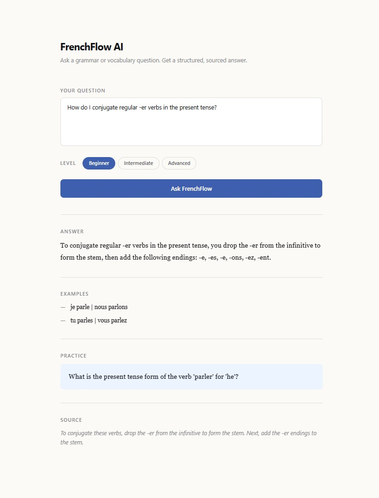

# FrenchFlow AI

An AI-powered French tutor that answers grammar and vocabulary questions using a curated knowledge base.

     



## Tech Stack

- **Frontend:** React, Tailwind CSS, Vite
- **Backend:** Python, FastAPI, Uvicorn
- **AI/RAG:** OpenAI API (`text-embedding-3-small`, `gpt-4o-mini`), ChromaDB

## Features

- Ask any French grammar or vocabulary question in natural language
- Choose your learner level: Beginner, Intermediate, or Advanced
- Receive a structured answer with explanation, usage examples, a practice question, and a source reference
- Explanations and practice questions are always in English; French example sentences are preserved in French
- Fully keyboard-accessible — level selector supports arrow-key navigation
- Loading, error, and success states with smooth transitions

## How It Works

1. The user submits a question and selects a learner level (Beginner, Intermediate, or Advanced)
2. The question is embedded using `text-embedding-3-small`
3. The top 3 closest chunks are retrieved from a ChromaDB vector store
4. `gpt-4o-mini` receives the question, level, and retrieved chunks as context
5. Returns a structured JSON response: answer, usage examples, a practice question, and a source snippet
6. Responses are always in English; French example sentences are preserved in French

## Local Setup

### Backend

```bash
cd backend
python -m venv .venv
.venv\Scripts\activate      # Mac/Linux: source .venv/bin/activate
pip install -r requirements.txt
cp .env.example .env        # fill in your OPENAI_API_KEY
```

Build the knowledge base (run once, requires `OPENAI_API_KEY`):

```bash
python ingest_tex.py
```

Start the server:

```bash
uvicorn main:app --reload
```

Backend runs at `http://localhost:8000`.
- `GET /` — health check
- `POST /ask` — accepts `{ question, level }`, returns `{ answer, examples, practice_question, source_snippet }`. Rate-limited to 10 requests/minute per IP.

### Frontend

```bash
cd frontend
npm install
npm run dev
```

Frontend runs at `http://localhost:5173`.

### Refresh the knowledge base

Delete `chroma_data/` and rerun the ingest script:

```bash
python ingest_tex.py
```

## Architecture

The vector store is ChromaDB with 34 chunks processed from [Tex's French Grammar](https://www.laits.utexas.edu/tex/) (26 pages covering nouns, articles, adjectives, verb conjugation, passé composé, imparfait, futur proche, object pronouns, negation, and interrogatives). The API is rate-limited at 10 requests/minute per IP and CORS-restricted to `http://localhost:5173`.

## Future Improvements

- Supabase Auth — user accounts and session management
- User profiles — saved level preference and personalisation
- Saved vocabulary — bookmark words and phrases for review
- Question and answer history — revisit past sessions
- Deployment — input limits, CORS restrictions, and usage controls (Vercel + Render/Railway)
- Security hardening — rate limit tuning, input validation, API key rotation policy
- Docker / Kubernetes — optional later DevOps improvements
- Pronunciation and accent coverage — currently out of scope (Tex's French Grammar has no dedicated pages for liaison, silent letters, or orthography)

## Attribution

The knowledge base includes content from [Tex's French Grammar](https://www.laits.utexas.edu/tex/), authored by Carl Blyth with contributions from Karen Kelton, Lindsy Myers, Catherine Delyfer, Yvonne Munn, and Jane Lippmann (University of Texas at Austin, Dept. of French and Italian, COERLL). Licensed under [CC BY 3.0](https://creativecommons.org/licenses/by/3.0). Content was fetched, cleaned, processed, and chunked for RAG retrieval context.
